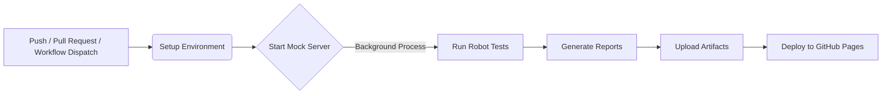

# IoT Device Integration Test Suite

[](https://pengfeili-oamk.github.io/iot-device-integration-tests/report)

[👉 Click here to view the Live Robot Framework Report](https://pengfeili-oamk.github.io/iot-device-integration-tests/report)

> **Note:** The live report is automatically deployed via GitHub Actions after every push.
## 📌 Project Overview
This project is an automated integration test suite designed for a simulated IoT environment. It demonstrates how to bridge the gap between **high-level API testing** and **low-level database verification** using **Robot Framework** and **Python**.

The suite simulates an industrial device (via a Flask-based Mock Server) and ensures that configuration changes are not only accepted by the API but also correctly persisted and consistent with business logic.
live report

---

## 🚀 Key Technical Highlights

### 1. Triangle Verification Strategy
Instead of simple API assertions, this suite implements a **Triangle Verification** logic:
* **API Layer**: Validates REST responses (Status codes, JSON structure).
* **Database Layer**: Connects to SQLite to verify actual data persistence.
* **Logic Layer**: Uses a custom Python Library (`IoTValidationLib.py`) to ensure consistency between the API output and the DB record.

### 2. Industrial-Grade Logic
* **Fail-Fast Mechanism**: The test suite validates data against physics/business rules (e.g., temperature range [-40, 85]) *before* invoking the SUT to save resources.
* **Data Integrity**: Handles floating-point precision issues using custom tolerance comparisons.
* **Robust Error Handling**: Server-side validation handles type mismatches and out-of-range inputs gracefully.

### 3. CI/CD Integration
* Powered by **GitHub Actions**.
* Automatically spins up the Mock Server (SUT) in a background process, executes the full test suite, and uploads HTML test reports as artifacts.

---

## 🛠️ Technology Stack
* **Testing Framework**: Robot Framework
* **Libraries**: RequestsLibrary, DatabaseLibrary (SQLite3)
* **Programming**: Python 3.x (Flask for SUT, Custom Validation Library)
* **CI/CD**: GitHub Actions

---

## 📈 How to Run
1. **Install Dependencies**:
```bash
   pip install -r sut/requirements.txt
   pip install -r requirements.txt
```
2. **Start the Mock Server**:
```bash
   python sut/app.py
```
3. **Execute Tests**:
```bash
   robot -d results tests/suites/
```
## 🔄 CI/CD Pipeline Workflow

This project utilizes **GitHub Actions** to automate the entire testing lifecycle. The pipeline is designed to simulate a real-world continuous integration environment where the SUT (System Under Test) must be spun up before verification.


### Pipeline Stages
1. **Environment Setup**: Installs Python 3.10 and dependencies (robotframework, flask, etc.).

2. **SUT Lifecycle Management**:
Starts the Flask Mock Server in the background (python sut/app.py &).
Waits for the port to listen before triggering tests to prevent "Connection Refused" errors.

3. **Test Execution**: Runs the Robot Framework integration suite targeting the local SUT instance.

4. **Artifact Management**:
Uploads the raw log.html and report.html as build artifacts.
Automatic Deployment: Pushes the HTML report to the gh-pages branch for live viewing.
---
**Author:** Pengfei Li